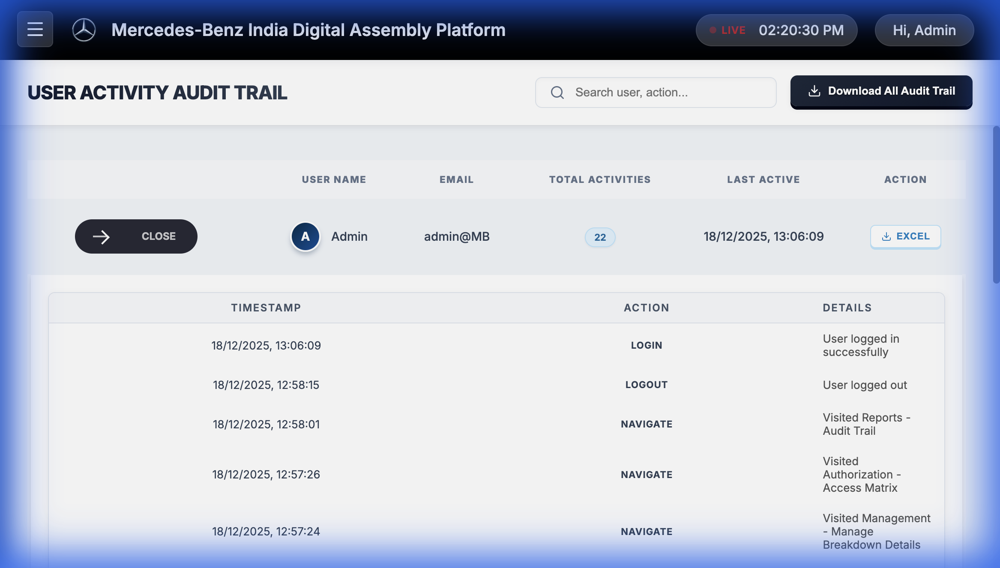

# Mercedes-Benz India Digital Assembly Platform
## Project Documentation & User Manual

**Version:** 1.0.0
**Date:** December 16, 2025
**Development Team:** Internal Development / DeepMind Assistant

---

## Table of Contents
1. [Project Overview](#1-project-overview)
2. [Technology Stack](#2-technology-stack)
3. [Folder Structure](#3-folder-structure)
4. [User Interface & Experience (UI/UX)](#4-user-interface--experience)
5. [Key Functionalities](#5-key-functionalities)
    - [Authentication & Security](#51-authentication--security)
    - [Dashboard](#52-dashboard)
    - [Andon System](#53-andon-system)
    - [Management Console](#54-management-console)
    - [Reporting & Audit Trail](#55-reporting--audit-trail)
6. [Automated Processes](#6-automated-processes)
7. [Getting Started](#7-getting-started)

---

## 1. Project Overview
The **Mercedes-Benz India Digital Assembly Platform** is a web-based Digital Assembly Platform (DAP) designed to modernize shop floor interactions, monitor production line status in real-time, and manage shift data efficiently. The application serves as a central hub for operators, supervisors, and administrators to access critical data involving:

*   **Real-time Andon status** (Production alerts)
*   **Stakeholder Analytics** (Maintenance, Logistics, Production, Quality)
*   **Shift & Station Management**
*   **Security & Access Control** (Role-based access)

## 2. Technology Stack
The application is built using a modern, scalable stack:

*   **Frontend Framework:** React 18+ (Vite)
*   **Language:** JavaScript (ES6+)
*   **Routing:** React Router v6
*   **State Management:** React Context API (`AuthContext`)
*   **Styling:** CSS3 variables, Flexbox/Grid, Glassmorphism design system
*   **Data Visualization:** Recharts (for dashboards and analytics)
*   **Icons:** Lucide-React
*   **Backend (Local):** Node.js + Express (for file system operations like Logging)
*   **Data Export:** XLSX (SheetJS) used for generating Excel reports

---

## 3. Folder Structure
The codebase follows a professional, modular architecture to ensure maintainability.

```
mercedes-benz-react-app/
├── public/                 # Static assets
├── src/
├── assets/             # Images, Videos, Global static files
├── context/            # Global State (Authentication, Logging)
├── layouts/            # Shared Layout Components
│   ├── MainLayout.jsx  # Wrapper for the protected app area
│   ├── Sidebar.jsx     # Collapsible navigation menu
│   ├── Header.jsx      # Top bar with clock & user profile
│   └── footer.jsx      # Application footer
├── pages/              # Application Screens
│   ├── Andon/          # Production line monitors (Trim4, Finish1...)
│   ├── Auth/           # Login, Signup, Access Matrix
│   ├── Dashboard/      # Main Home Dashboard
│   ├── Management/     # Administration forms (Shift, Line, Station)
│   └── Reports/        # Audit Trail, Infeed Reports
├── App.jsx             # Main Router Configuration
└── main.jsx            # Entry Point
├── Audit_Trial_Report_AutoSave # Auto-generated logs folder
└── server.js               # Local backend for file operations
```

---

## 4. User Interface & Experience
The project features a **Premium Dark/Glassmorphic UI** consistent with the luxury brand identity of Mercedes-Benz.

### Global Elements
*   **Sidebar:** A collapsible navigation menu featuring a video background and glassmorphic overlay for a premium feel. It dynamically shows/hides sections based on user roles.
*   **Header:** Features a live digital clock, network status indicator, and user profile dropdown.
*   **Visuals:** High-quality background videos, smooth transitions, and brand-compliant fonts.


---

## 5. Key Functionalities

### 5.1 Authentication & Security
The system secures data through a comprehensive `AuthContext`.
*   **Login/Signup:** Users can create accounts which require Admin approval.
*   **Role-Based Access Control (RBAC):**
    *   **Admin:** Full access to all modules, including Authorization and Audit Trails.
    *   **User:** Restricted access to operational dashboards only.
*   **Session Management:** Keeps users logged in and tracks their session activity.


### 5.2 Dashboard
The landing page provides a high-level overview of factory performance.
*   **Visuals:** Area charts displaying alarms per stakeholder (Logistics, Maintenance, etc.).
*   **Interactive Tooltips:** Hovering over charts reveals detailed metrics.


### 5.3 Andon System
Real-time monitoring screens for various assemblly lines (e.g., Trim 4, Mech 3).
*   **Production Status Table:** Shows Shift Target, Due, and Actual counts.
*   **Time Monitoring:** Tracks Takt time and Lost time.
*   **Color-Coded Feedback:** Green/Red text indicates performance against targets.


### 5.4 Management Console
A suite of tools for supervisors to configure the line:
*   **Manage Shift:** Define shift timings.
*   **Manage Line/Station:** Configure production line parameters.
*   **Manage KPI:** Set targets for output and efficiency.

### 5.5 Reporting & Audit Trail
**Admin-Only Feature.**
*   **Audit Trail:** Logs every significant user action (Login, Navigation, Data Change).
*   **Access Matrix:** A centralized hub to view all users, manage their permissions, and view individual activity logs.
*   **Export:** Data can be exported to Excel/CSV for offline analysis.




---

## 6. Automated Processes

### Auto-Save System
The application ensures data integrity and regulatory compliance through a rigorous background logging process managed by `AuthContext` and `server.js`.

#### Logic Flow:
1.  **Trigger:** The system checks for activity logs every **60 seconds**.
2.  **Hourly Save:** If the hour has changed since the last save (e.g., moving from 10:59 AM to 11:00 AM), the pending logs are sent to the local server.
3.  **File Format:**
    *   **Directory:** `Audit_Trial_Report_AutoSave/{DDMMYYYY}/`
    *   **Filename:** `{HHMM}_{DDMMYYYY}.xlsx` (e.g., `1430_16122025.xlsx`)
4.  **Daily Reset (06:00 AM):**
    *   The system detects if the current hour is **6 (6:00 AM)**.
    *   It securely saves all logs from the night shift.
    *   It **clears the active memory cache** (`activityLogs`) in the browser to start the new production day with a clean slate.

---

## 7. Getting Started

### Prerequisites
*   Node.js (v18 or higher)
*   NPM (Node Package Manager)

### Installation
1.  Navigate to the project directory:
    ```bash
    cd mercedes-benz-react-app
    ```
2.  Install dependencies:
    ```bash
    npm install
    ```

### Running the Application
To start both the Frontend UI and the Backend Logging Server:
```bash
npm run dev
```
*   **UI:** Access at `http://localhost:5173`
*   **Server:** Runs internally on port `3001`
**Version:** 1.0.0
**Date:** December 16, 2025
**Development Team:** Internal Development / DeepMind Assistant

---

## Table of Contents
1. [Project Overview](#1-project-overview)
2. [Technology Stack](#2-technology-stack)
3. [Folder Structure](#3-folder-structure)
4. [User Interface & Experience (UI/UX)](#4-user-interface--experience)
5. [Key Functionalities](#5-key-functionalities)
    - [Authentication & Security](#51-authentication--security)
    - [Dashboard](#52-dashboard)
    - [Andon System](#53-andon-system)
    - [Management Console](#54-management-console)
    - [Reporting & Audit Trail](#55-reporting--audit-trail)
6. [Automated Processes](#6-automated-processes)
7. [Getting Started](#7-getting-started)

---

## 1. Project Overview
The **Mercedes-Benz India Digital Assembly Platform** is a web-based Digital Assembly Platform (DAP) designed to modernize shop floor interactions, monitor production line status in real-time, and manage shift data efficiently. The application serves as a central hub for operators, supervisors, and administrators to access critical data involving:

*   **Real-time Andon status** (Production alerts)
*   **Stakeholder Analytics** (Maintenance, Logistics, Production, Quality)
*   **Shift & Station Management**
*   **Security & Access Control** (Role-based access)

## 2. Technology Stack
The application is built using a modern, scalable stack:

*   **Frontend Framework:** React 18+ (Vite)
*   **Language:** JavaScript (ES6+)
*   **Routing:** React Router v6
*   **State Management:** React Context API (`AuthContext`)
*   **Styling:** CSS3 variables, Flexbox/Grid, Glassmorphism design system
*   **Data Visualization:** Recharts (for dashboards and analytics)
*   **Icons:** Lucide-React
*   **Backend (Local):** Node.js + Express (for file system operations like Logging)
*   **Data Export:** XLSX (SheetJS) used for generating Excel reports

---

## 3. Folder Structure
The codebase follows a professional, modular architecture to ensure maintainability.

```
mercedes-benz-react-app/
├── public/                 # Static assets
├── src/
│   ├── assets/             # Images, Videos, Global static files
│   ├── context/            # Global State (Authentication, Logging)
│   ├── layouts/            # Shared Layout Components
│   │   ├── MainLayout.jsx  # Wrapper for the protected app area
│   │   ├── Sidebar.jsx     # Collapsible navigation menu
│   │   ├── Header.jsx      # Top bar with clock & user profile
│   │   └── footer.jsx      # Application footer
│   ├── pages/              # Application Screens
│   │   ├── Andon/          # Production line monitors (Trim4, Finish1...)
│   │   ├── Auth/           # Login, Signup, Access Matrix
│   │   ├── Dashboard/      # Main Home Dashboard
│   │   ├── Management/     # Administration forms (Shift, Line, Station)
│   │   └── Reports/        # Audit Trail, Infeed Reports
│   ├── App.jsx             # Main Router Configuration
│   └── main.jsx            # Entry Point
├── Audit_Trial_Report_AutoSave # Auto-generated logs folder
└── server.js               # Local backend for file operations
```

---

## 4. User Interface & Experience
The project features a **Premium Dark/Glassmorphic UI** consistent with the luxury brand identity of Mercedes-Benz.

### Global Elements
*   **Sidebar:** collapsible, video-background sidebar that provides navigation.
*   **Header:** Features a live digital clock, network status indicator, and user profile dropdown.
*   **Visuals:** High-quality background videos, smooth transitions, and brand-compliant fonts.

---

## 5. Key Functionalities

### 5.1 Authentication & Security
The system secures data through a comprehensive `AuthContext`.
*   **Login/Signup:** Users can create accounts which require Admin approval.
*   **Role-Based Access Control (RBAC):**
    *   **Admin:** Full access to all modules, including Authorization and Audit Trails.
    *   **User:** Restricted access to operational dashboards only.
*   **Session Management:** Keeps users logged in and tracks their session activity.


### 5.2 Dashboard
The landing page provides a high-level overview of factory performance.
*   **Visuals:** Area charts displaying alarms per stakeholder (Logistics, Maintenance, etc.).
*   **Interactive Tooltips:** Hovering over charts reveals detailed metrics.


### 5.3 Andon System
Real-time monitoring screens for various assemblly lines (e.g., Trim 4, Mech 3).
*   **Production Status Table:** Shows Shift Target, Due, and Actual counts.
*   **Time Monitoring:** Tracks Takt time and Lost time.
*   **Color-Coded Feedback:** Green/Red text indicates performance against targets.


### 5.4 Management Console
A suite of tools for supervisors to configure the line:
*   **Manage Shift:** Define shift timings.
*   **Manage Line/Station:** Configure production line parameters.
*   **Manage KPI:** Set targets for output and efficiency.

### 5.5 Reporting & Audit Trail
**Admin-Only Feature.**
*   **Audit Trail:** Logs every significant user action (Login, Navigation, Data Change).
*   **Access Matrix:** A centralized hub to view all users, manage their permissions, and view individual activity logs.
*   **Export:** Data can be exported to Excel/CSV for offline analysis.


---

## 6. Automated Processes

### Auto-Save System
The application includes a background service to ensure data integrity.
*   **Hourly Backup:** Every hour, current activity logs are saved to the `Audit_Trial_Report_AutoSave` folder.
*   **Daily Reset:** At **06:00 AM**, the system:
    1.  Archives the previous day's logs.
    2.  Clears the active memory cache to maintain performance.
    3.  Creates a new dated folder for the new shift.

---

## 7. Getting Started

### Prerequisites
*   Node.js (v18 or higher)
*   NPM (Node Package Manager)

### Installation
1.  Navigate to the project directory:
    ```bash
    cd mercedes-benz-react-app
    ```
2.  Install dependencies:
    ```bash
    npm install
    ```

### Running the Application
To start both the Frontend UI and the Backend Logging Server:
```bash
npm run dev
```
*   **UI:** Access at `http://localhost:5173`
*   **Server:** Runs internally on port `3001`
